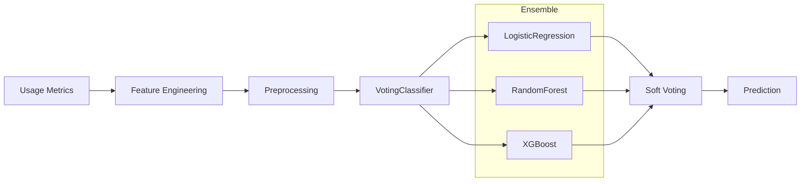

# TelecomAI Customer Intelligence

Strategic customer intelligence for telecommunications.

<!-- [PLACEHOLDER: Insert TelecomAI demo GIF or screenshot here] -->
<!--  -->

## Overview

**TelecomAI Customer Intelligence** predicts whether customers should be recommended an upgraded plan based on their usage patterns. It demonstrates advanced ensemble methods with VotingClassifier and domain-specific feature engineering.

## Key Metrics

| Metric | Value | Description |
|--------|-------|-------------|
| **AUC-ROC** | *[TO BE FILLED]* | Area under ROC curve |
| **Accuracy** | *[TO BE FILLED]* | Classification accuracy |
| **Test Coverage** | 96% | Unit + integration tests |

## Quick Start

### Using Docker

```bash
cd TelecomAI-Customer-Intelligence
docker build -t telecom:latest .
docker run -p 8000:8000 telecom:latest
```

### API Access

http://localhost:8003/docs

## API Reference

### Predict Endpoint

**POST** `/predict`

```bash
curl -X POST "http://localhost:8003/predict" \
  -H "Content-Type: application/json" \
  -d '{
    "calls": 50,
    "minutes": 500,
    "messages": 100,
    "mb_used": 20000,
    "is_ultimate": 0
  }'
```

**Response:**

```json
{
  "prediction": 1,
  "probability": 0.78,
  "recommendation": "upgrade_recommended"
}
```

## Model Architecture



## Configuration

```yaml
# configs/config.yaml
data:
  train_path: "data/raw/telecom.csv"
  target_column: "is_ultra"

model:
  voting: "soft"
  estimators:
    - logistic_regression
    - random_forest
```

## Project Structure

```
TelecomAI-Customer-Intelligence/
├── src/telecom/
│   ├── __init__.py
│   ├── data.py           # Data loading
│   ├── training.py       # Model training
│   ├── prediction.py     # Batch inference
│   └── evaluation.py     # Metrics
├── app/
│   └── fastapi_app.py    # REST API
├── tests/
├── configs/
└── Dockerfile
```

## Known Limitations

1. **Single Carrier**: Model trained on specific carrier data
2. **Usage Only**: Doesn't consider customer demographics
3. **Binary Output**: Only upgrade/no-upgrade recommendation

## Related Documentation

- [Model Card](https://github.com/DuqueOM/ML-MLOps-Portfolio/blob/main/TelecomAI-Customer-Intelligence/models/model_card.md)
- [API Reference](../api/rest-apis.md)
