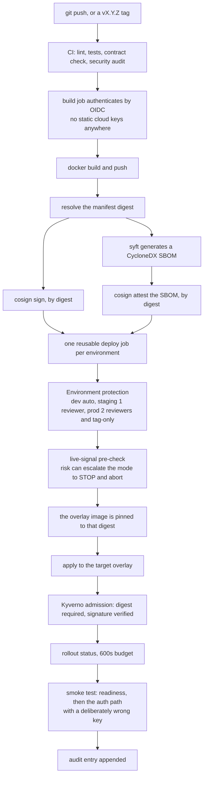
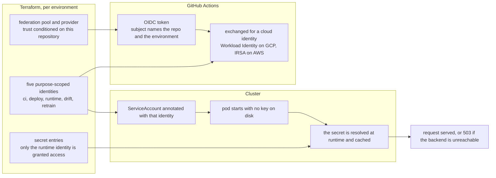
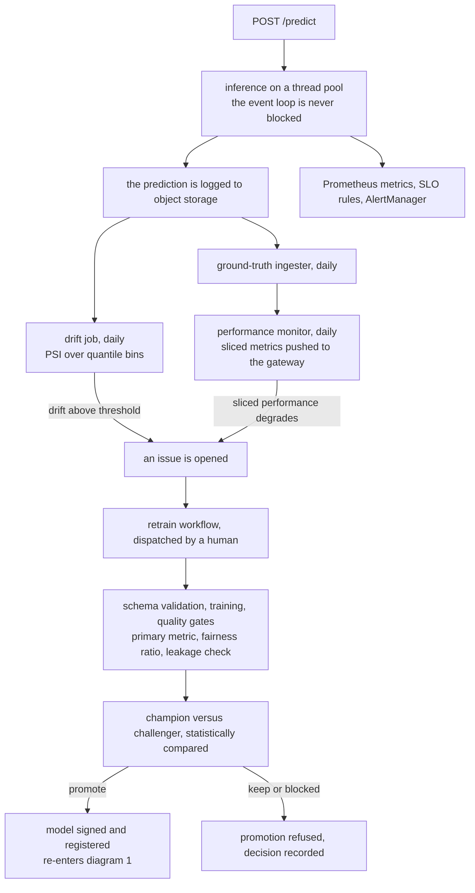
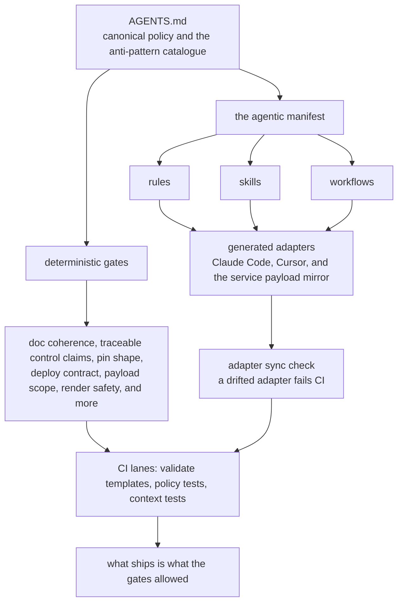

# Production Template

<canvas data-neural-scene="cube" aria-hidden="true"></canvas>
Production template and agentic operating model

# A reusable ML service template with governed AI-assisted engineering

The [ML Service Template](https://github.com/DuqueOM/ml-service-template)
is the strongest artifact in this portfolio. It packages the production lessons
from the monorepo into a starter system for ML services: FastAPI serving,
training/serving parity, CI/CD, Docker, Kubernetes, Terraform examples,
observability hooks, runbooks and an explicit agentic governance model. The
template also encodes 38 anti-patterns with corrective actions, SLSA L2
supply-chain security practices, closed-loop monitoring with statistical
promotion gates, native-cloud edge protection (Cloud Armor / AWS WAF+Shield,
Cloudflare optional), and a self-auditing documentation-coherence system that
keeps its own version, ADR count and governance surface honest across every
document — a gate, not a suggestion.

[Open the template repo](https://github.com/DuqueOM/ml-service-template){ .portfolio-button .portfolio-button--primary }
[Read the quick start](https://github.com/DuqueOM/ml-service-template/blob/main/QUICK_START.md){ .portfolio-button }
[Review technical evidence](technical-evidence.md){ .portfolio-button }

<strong>Its scope limit is a decision, not an omission</strong>

This template scaffolds <strong>one</strong> governed tabular ML service, with
small-team calibration throughout — "2–3 models → CronJob, not Airflow";
"in-memory DataFrames → Pandera, not Great Expectations". Widening it to cover
feature stores, lakehouse table formats, distributed training, GenAI serving
and multi-project orchestration would not improve it: it would destroy the
property that makes it recommendable, which is that it is small enough to read
in an afternoon.

That work sits <em>above</em> this boundary, and it got its own repository —
<a href="../ml-platform/">ml-platform</a>, the second and enterprise template.
It <em>consumes</em> this one through <code>copier</code> rather than
replacing it: where the two disagree about serving, containers, probes,
manifests or supply chain, <strong>this template wins</strong>.
<a href="../related-projects/#the-two-templates-side-by-side">See the two side by side →</a>

<small>Serving baseline</small>
<strong>FastAPI scaffold</strong>
Predict, batch predict, health, readiness, metrics and model operations.

<small>Cloud posture</small>
<strong>GKE + EKS ready</strong>
Kubernetes overlays and Terraform examples for both paths.

<small>Failure modes</small>
<strong>38 anti-patterns</strong>
Corrective actions for serving, HPA, SHAP, IAM, CI/CD, scaffolding and adoption risks.

<small>Supply chain</small>
<strong>SLSA L2 posture</strong>
Security scanning, build hygiene and provenance-oriented release practices.

<small>Agentic governance</small>
<strong>AUTO / CONSULT / STOP</strong>
Rules for when agents can act, ask or halt for safety.

<small>Monitoring loop</small>
<strong>Promotion gates</strong>
Closed-loop monitoring ideas tied to statistical quality gates.

## How To Read This Template

<small>Recruiter view</small>
<h3>Reusable system, not only a project</h3>

The important signal is that portfolio lessons became a repeatable starter
system for future ML services, with defaults, guardrails and documentation.

<small>Technical lead view</small>
<h3>Inspect the operating contracts</h3>

The best evidence is in the rules, skills, workflows, manifest and
anti-pattern catalog that constrain how services are generated and operated.

<small>Team adoption view</small>
<h3>Can another engineer use it?</h3>

The template is designed around quick start, service scaffold, tests,
deployment artifacts and reviewable AI-assisted workflows.

## Code Review Shortcuts

[Service Dockerfile](https://github.com/DuqueOM/ml-service-template/blob/main/templates/service/Dockerfile){ .portfolio-button .portfolio-button--primary }
[K8s deployment](https://github.com/DuqueOM/ml-service-template/blob/main/templates/service/k8s/base/deployment.yaml){ .portfolio-button }
[CI template](https://github.com/DuqueOM/ml-service-template/blob/main/templates/service/.github/workflows/ci.yml){ .portfolio-button }
[Deploy GCP](https://github.com/DuqueOM/ml-service-template/blob/main/templates/service/.github/workflows/deploy-gcp.yml){ .portfolio-button }
[Agent manifest](https://github.com/DuqueOM/ml-service-template/blob/main/templates/config/agentic_manifest.yaml){ .portfolio-button }
[Agent rules](https://github.com/DuqueOM/ml-service-template/tree/main/agentic/rules){ .portfolio-button }
[Agent skills](https://github.com/DuqueOM/ml-service-template/tree/main/agentic/skills){ .portfolio-button }
[Agent workflows](https://github.com/DuqueOM/ml-service-template/tree/main/agentic/workflows){ .portfolio-button }

## Why This Is More Than A Template

The template is not only a folder structure. It is an operating contract for
starting ML services with fewer avoidable mistakes. It defines what a generated
service should contain, how it should be validated, which deployment paths it
can follow and how AI agents are allowed to participate in the work.

The important point is the second-order artifact: I did not only build three
portfolio services. I extracted the reusable production system behind them.

<strong>Technical reviewer signal</strong>

The most distinctive part is the agentic operating model: canonical rules,
skills, workflows and risk escalation are written as code-adjacent governance,
not left as informal prompting.

## Production Scaffold Contract

<small>1. Service API</small>
<h3>FastAPI by default</h3>

The scaffold includes prediction endpoints, batch prediction, readiness,
health, metrics, error envelopes, auth hooks and model metadata.

<small>2. ML lifecycle</small>
<h3>Training to serving parity</h3>

Feature engineering, schema validation, model loading and inference contracts
are treated as one path instead of separate notebook and API worlds.

<small>3. Quality gates</small>
<h3>CI before adoption</h3>

YAML checks, workflow checks, scaffold tests, smoke paths, pre-commit hooks
and targeted validations protect the generated service.

<small>4. Runtime</small>
<h3>Docker and Kubernetes</h3>

Containers, Kustomize overlays, readiness probes and deployment defaults are
part of the service contract from the beginning.

<small>5. Observability</small>
<h3>Metrics and operations hooks</h3>

Prometheus-compatible metrics, prediction logging, tracing options, drift
checks and retraining workflows are built into the template story. A
six-station coverage audit (edge, infra, inference, models, logs/traces,
business KPIs) closed the real gaps it found: executor-saturation metrics,
a business-KPI dashboard, and a structured access log that actually
correlates a request to its trace on every call, not only on failures.

<small>6. Cloud path</small>
<h3>GCP and AWS patterns</h3>

The template documents GKE/EKS deployment expectations, identity patterns,
artifact registries and operational runbooks without pretending local tests are
cloud proof. An opt-in edge layer (Cloud Armor / AWS WAF+Shield, Cloudflare
optional) sits in front of the Ingress once an adopter wires it in.

## How It Works, In Four Diagrams

The contracts above are written out in prose in the repository, because a
contract needs prose. The first hour does not. These four diagrams are the
shortest honest description of what the template actually does — the deploy
chain, identity and secrets, the monitoring loop, and what governs the agentic
surface. Each one describes behaviour that exists in the tree today; the same
four, with the file that implements every step, live in
[`docs/DIAGRAMS.md`](https://github.com/DuqueOM/ml-service-template/blob/main/docs/DIAGRAMS.md).

### 1. From a commit to a pod you can verify

One property matters before any other: the thing that is signed, the thing
that is scanned and the thing the cluster admits are the **same bytes**,
because every step after the build addresses the image by digest rather than
by tag. A tag can be moved; a digest cannot.

Two of those steps exist because the obvious version failed. Building and
signing a *tag* leaves a window in which the tag can move, so the build job
emits a digest map and the deploy job rewrites the overlay with it. And a
readiness probe alone once went green on a deployment whose every
authenticated request failed — readiness never touches the secret backend — so
the smoke test sends a key that is deliberately wrong: `401` proves the secret
resolved, `503` proves it did not.

### 2. Who the code is, and where its secrets come from

There is no credential file anywhere in this template: not in the repository,
not in the image, not on the node. Every actor proves its identity with a
short-lived token, and the identities are deliberately separate — the job that
detects drift cannot read the API key, and the job that retrains cannot delete
a model.

The part that is easy to get wrong is the **name**. Terraform decides what a
secret is called and the pod has to ask for the same string — joined with `-`
on GCP and `/` on AWS. That join lives in one function, and a contract test
evaluates the Terraform interpolations against the Kubernetes overlays so four
layers cannot quietly choose four different names. Failure is closed: if the
backend is unreachable in staging or production the service answers `503`
rather than falling back to an unauthenticated path.

### 3. The loop that closes

A monitoring setup that only emits metrics is an open loop — it can say
something changed, but nothing downstream is obliged to act. This one closes,
and it closes through artefacts a human reads: an issue, a quality-gate
report, a champion-versus-challenger decision. Not an automatic push to
production.

The fairness gate uses a disparate impact ratio with a floor of `0.80`, the US
four-fifths rule — and the template says in the same file that this is a
starting point rather than a universal threshold, that the metric is
group-level, that it is unreliable on small subgroups, and that passing it
does not by itself make a model fair.

### 4. What governs the agent

The agentic surface is not load-bearing. Agents make the work faster; the
gates decide what ships. Everything an agent reads is generated from one
canonical tree, and a check fails CI when a generated adapter stops matching
its source — so a rule cannot be softened in one IDE's copy without the
difference appearing in a diff.

The same idea applies to the page you are reading. The template's coherence
gate reconciles the claims that appear in more than one document — the
version, the anti-pattern count, the agentic surface counts, ADR numbering —
against the tree, in every live document at once rather than in a list of
filenames someone has to remember to extend.

## Agentic Operating Model

<small>Canonical rules</small>
<h3>One source of truth</h3>

<code>AGENTS.md</code>, agent context and the manifest define the behavior contract.
Adapter files point to canonical rules instead of drifting into parallel policy.

<small>Risk matrix</small>
<h3>AUTO / CONSULT / STOP</h3>

Low-risk work can be automated, ambiguous production work requires user
consultation, and destructive or safety-sensitive actions must stop.

<small>Workflow skills</small>
<h3>Repeatable MLOps actions</h3>

New service creation, drift checks, retraining, rollback, cost review,
release, incident and security workflows are encoded as reusable agent skills.

<small>Reviewability</small>
<h3>Agents leave evidence</h3>

The model is designed around validation logs, changelogs, ADRs, runbooks and
explicit test commands so agent-assisted work remains auditable.

## Rules, Skills And Workflows

<small>Rules (19)</small>
<h3><a href="https://github.com/DuqueOM/ml-service-template/tree/main/agentic/rules">Context-aware engineering constraints</a></h3>

Rules cover Python serving, training, Kubernetes, Terraform, Docker,
GitHub Actions, monitoring, data validation, security, API contracts,
Copier template lifecycle, documentation coherence and edge protection
(Cloud Armor / AWS WAF+Shield / optional Cloudflare). The goal is to make
failure modes harder to reintroduce.

<small>Skills (27)</small>
<h3><a href="https://github.com/DuqueOM/ml-service-template/tree/main/agentic/skills">Reusable MLOps procedures</a></h3>

Skills include new service creation, EDA, deploy to GKE/EKS, drift checks,
model retraining, release checklist, rollback, cost audit, security audit,
incident response, stack-profile switching, adopter onboarding,
documentation-coherence enforcement, CI-green verification, dual-axis PR
review, systematic bug diagnosis, pre-scaffold ML problem spec capture,
blameless incident postmortems and edge-protection coverage auditing.

<small>Workflows (20)</small>
<h3><a href="https://github.com/DuqueOM/ml-service-template/tree/main/agentic/workflows">Slash-command operating paths</a></h3>

Workflows such as <code>/new-service</code>, <code>/incident</code>,
<code>/release</code>, <code>/drift-check</code>, <code>/retrain</code>,
<code>/rollback</code>, <code>/secret-breach</code>, <code>/stack-switch</code>,
<code>/onboard</code>, <code>/doc-coherence</code>, <code>/ci-green</code> and
<code>/edge-setup</code> turn repeatable MLOps work into auditable steps.

## Anti-Pattern Catalog

<small>Serving</small>
<h3>No <code>uvicorn --workers N</code> under Kubernetes</h3>

<strong>Corrective action:</strong> one worker per pod, HPA for horizontal
scaling, and <code>ThreadPoolExecutor</code> for CPU-bound inference.

<small>Autoscaling</small>
<h3>No memory-based HPA for ML pods</h3>

<strong>Corrective action:</strong> use CPU as the scaling signal because
loaded models keep a fixed memory footprint even when traffic drops.

<small>Async APIs</small>
<h3>No direct <code>model.predict()</code> in async endpoints</h3>

<strong>Corrective action:</strong> move CPU-bound prediction work behind
<code>asyncio.run_in_executor()</code> so request handling stays responsive.

<small>Explainability</small>
<h3>No TreeExplainer for StackingClassifier</h3>

<strong>Corrective action:</strong> use KernelExplainer with a
predict-proba wrapper in the original feature space.

<small>Packaging</small>
<h3>No model artifacts baked into Docker images</h3>

<strong>Corrective action:</strong> keep images immutable and load model
artifacts through runtime storage patterns such as init containers.

<small>Security</small>
<h3>No static cloud credentials in production paths</h3>

<strong>Corrective action:</strong> use Workload Identity on GCP and IRSA on
AWS, with CI/deploy/runtime identities separated by purpose.

<small>Adoption safety</small>
<h3>No cloud credentials in a "local" stack profile</h3>

<strong>Corrective action:</strong> a <code>local</code> profile must
structurally refuse cloud credentials, Kubernetes and Docker — enforced by
a contract test and a runtime guard in <code>make deploy</code>, not just
a naming convention.

<small>Release safety</small>
<h3>No promoting or deploying on red/missing CI</h3>

<strong>Corrective action:</strong> a read-only skill verifies CI status
before release or a staging/prod deploy; overriding a red or missing signal
requires explicit human approval and an audit-trail entry (D-36).

<small>Edge exposure</small>
<h3>No public Ingress without edge protection</h3>

<strong>Corrective action:</strong> a production overlay must wire in
Cloud Armor or AWS WAF+Shield (Cloudflare optional) before going live;
disabling an existing WAF/rate-limit rule is a STOP-class action in every
environment, no exceptions (D-38).

## Adoption Engineering &amp; Self-Auditing Documentation

Governance only counts if adopting the template is actually easy. A later
pass ([<code>v0.19.0</code>–<code>v0.20.0</code>](https://github.com/DuqueOM/ml-service-template/blob/main/CHANGELOG.md))
rebuilt the scaffolding path on [Copier](https://copier.readthedocs.io/)
(so <code>copier update</code> can pull template improvements into an
already-adopted service), added local-first stack profiles so a reviewer
can evaluate the whole train → serve → drift loop without provisioning a
cluster, and mapped the production layout to the Cookiecutter Data
Science vocabulary for practitioners coming from a notebook-first
background.

The differentiated piece is the last one: a **documentation coherence
system** that treats "the docs agree with reality" as a CI-enforced
contract, not a hope.

<strong>Technical reviewer signal</strong>

An independent audit of this exact work found and fixed a real bug before
release: an onboarding flow was validating its output against the wrong
JSON schema and would have failed on first use. The fix, and four other
real defects, are documented in the release notes instead of quietly
folded in — that disclosure habit is the same one the template asks of
its adopters.

<small>Scaffolding</small>
<h3>Copier, not <code>cp</code> + <code>sed</code></h3>

A custom Jinja delimiter (<code>{@ @}</code>) avoids collisions with the
literal <code>${{ }}</code> GitHub Actions syntax the template ships. Two
anti-patterns (D-33, D-34) keep the scaffolder from regressing to manual
substitution.

<small>Local-first profiles</small>
<h3><code>local</code> / <code>staging</code> / <code>prod</code></h3>

Chosen at scaffold time; <code>local</code> runs the full loop with zero
cloud dependencies. Switching profiles is a reviewable, CONSULT-mode
operation, never a silent edit.

<small>Recognizable layout</small>
<h3>A generated CCDS mapping</h3>

A documentation-only view translates the production directory layout
into Cookiecutter Data Science vocabulary — no directories renamed, no
production path touched.

<small>Self-auditing docs</small>
<h3><a href="https://github.com/DuqueOM/ml-service-template/blob/main/docs/decisions/ADR-031-documentation-coherence-system.md">A CI gate for the docs themselves</a></h3>

One deterministic script enforces a single source of truth for release
version, anti-pattern count, agentic-surface counts and ADR numbering
across every document — a gate, not a suggestion.

## Enterprise Governance &amp; Compliance Posture

A later benchmarking pass compared the template against NIST AI RMF, ISO/IEC
42001, the EU AI Act and frontier open-source scaffolds — not against the
author's other repos. The finding: the template already produces the
evidence these frameworks ask for (quality gates, fairness thresholds, an
audit trail, human-in-the-loop approval). What it lacked was the map
connecting that evidence to each framework's own vocabulary.

<strong>The discipline that matters most</strong>

The compliance document is explicit about what it is <em>not</em>: not a
certification, not a substitute for legal review, not a claim that any
template can be "AI Act compliant" — only a deployed, operated system can
be evaluated. Declining to over-claim is itself the signal.

<small>Compliance mapping</small>
<h3><a href="https://github.com/DuqueOM/ml-service-template/blob/main/docs/COMPLIANCE_MAPPING.md">NIST AI RMF · ISO/IEC 42001 · EU AI Act</a></h3>

Traces artifacts the template already produces — quality gates, the
fairness DIR floor, the audit trail, AUTO/CONSULT/STOP human oversight — to
each framework's own control questions. Descriptive, never certifying.

<small>Supply chain</small>
<h3>SHA-pinned CI + OpenSSF Scorecard</h3>

Every GitHub Action across every workflow is pinned by commit SHA, not a
mutable tag. A dedicated Scorecard workflow scores the repo against
OpenSSF's supply-chain criteria on every push.

<small>Agentic governance pattern</small>
<h3>Read is AUTO, override is STOP</h3>

The newest gate (D-36) separates "check whether CI is green" (always
allowed, read-only) from "proceed despite red or missing CI" (an explicit
human STOP-class approval, logged to the audit trail) — wired as a hard
precondition into release and staging/prod deploy.

<small>Portability</small>
<h3><a href="https://github.com/DuqueOM/ml-service-template/blob/main/docs/ADOPTION.md">Escape hatches, not lock-in</a></h3>

A documented swap matrix for cloud, experiment tracking, serving backend,
IaC engine and scaffolding tool — so "agnostic to technologies" is a
verifiable claim, not a slogan.

<small>Edge protection</small>
<h3><a href="https://github.com/DuqueOM/ml-service-template/blob/main/docs/decisions/ADR-042-native-cloud-edge-protection.md">Native-cloud-first, Cloudflare optional</a></h3>

Cloud Armor and AWS WAF+Shield Standard are the default per-cloud WAF and
DDoS layer; Cloudflare stays available for genuinely concurrent multi-cloud
deployments, but is never the default — the common case is one cloud, not
a third-party account layered on top of it.

## How It Compares

None of the well-known alternatives occupy quite the same spot. Each is
genuinely strong at what it optimizes for — the comparison below is about
fit, not a claim that this template is universally "better."

<strong>The honest version</strong>

This is a hardening baseline for a small-to-mid ML team that wants
production defaults without adopting a control-plane. It is not a
managed pipeline product, not a full MLOps platform, and not a
drop-in replacement for an already-mature internal platform team.

| Alternative | Strong at | What this template adds |
|---|---|---|
| **Cookiecutter Data Science** | The most recognized project-layout convention; huge familiarity | CCDS gives you a folder shape. It has no serving contract, no CI/CD, no Kubernetes/Terraform, no supply-chain security and no agentic governance — this template maps to CCDS vocabulary for practitioners coming from it (see Adoption Engineering above) rather than competing with it. |
| **Kubeflow** | Full ML platform: pipelines, serving, multi-tenancy, a real control plane | Kubeflow needs a dedicated operator and real operational investment before the first service ships. This template is a starter a small team can scaffold from cold in minutes, with the option to grow into a platform like Kubeflow later — not a prerequisite for one. |
| **MLRun / ZenML / Metaflow** | Strong pipeline/DAG orchestration abstractions, good experiment ergonomics | These orchestrate the ML workflow; none of them ship Kubernetes manifests, Terraform, signed-image CI/CD, or an agentic governance layer as part of the same starter — you still assemble the production surface yourself. |
| **Cloud-native pipelines (Vertex AI Pipelines, SageMaker Pipelines)** | Managed, low operational burden, deep integration with one cloud | Powerful, but cloud-locked — you build *on* the platform, not *with* portable source you own. This template ships working Terraform + Kustomize for both GCP and AWS, so the same service definition targets either. |
| **Bespoke internal platform-engineering scaffolds** | Tailored exactly to one company's stack; common in mature orgs | Usually unpublished, un-audited by outsiders, and rarely include a first-class agentic governance layer — that concern barely existed when most internal scaffolds were built. This template treats it as a testable, CI-gated contract from the start. |

The throughline across every row: this template is the only common option
that ships a complete infra-to-serving stack **and** a governed,
contract-tested agentic development layer as one coherent, adoptable unit
— not a platform to operate, and not a governance story left to prompting.

## Multi-IDE Governance

<small>Canonical source</small>
<h3>A vendor-neutral body store</h3>

Rules, skills and workflows live once in <code>agentic/</code> — not named
after any single IDE, so a tool rebrand (this happened once already) can
never strand the source of truth again.

<small>Portable adapters</small>
<h3>Devin, Cursor, Claude Code and Codex</h3>

Devin ingests full bodies, so <code>.devin/</code> is a generated
byte-for-byte mirror. Cursor, Claude Code and Codex read pointer files.
Both kinds are regenerated by one script and never hand-edited.

<small>Manifest</small>
<h3><a href="https://github.com/DuqueOM/ml-service-template/blob/main/templates/config/agentic_manifest.yaml">Cross-surface index</a></h3>

The manifest maps rules, skills and workflows across IDE surfaces so the
governance model can be validated instead of trusted by memory.

<small>Behavior protocol</small>
<h3>AUTO / CONSULT / STOP everywhere</h3>

Risk class is independent of the assistant being used. Low-risk work can
run, ambiguous work asks, and destructive or production-sensitive work stops.

## What A Reviewer Should Inspect

<small>First scaffold</small>
<h3>Can it generate a usable service?</h3>

A reviewer should be able to scaffold a service, run the local checks and
see a coherent FastAPI project with tests and deployment artifacts.

<small>Serving contract</small>
<h3>Does inference match training?</h3>

The service should preserve feature parity, validate inputs and expose
readiness based on model loading rather than a superficial health endpoint.

<small>Governance contract</small>
<h3>Can agents act safely?</h3>

The strongest technical signal is whether agent workflows are bounded by
rules, manifests, validations and explicit escalation points.

<small>Cloud realism</small>
<h3>Are claims scoped honestly?</h3>

The template distinguishes local validation from real GKE/EKS validation,
which keeps the documentation useful without overstating production proof.

## What It Shows About Me

| Signal | What it means |
|--------|---------------|
| Product thinking | I turned portfolio lessons into a reusable starter system. |
| MLOps discipline | The template treats serving, testing, packaging and deployment as one system. |
| Governance mindset | AI-assisted engineering is bounded by explicit rules, not only prompts. |
| Operational honesty | Cloud validation, cost control and limitations are documented instead of hidden. |
| Documentation taste | The repo is designed so another engineer can adopt, review and improve it. |

## Where To Go Next

<small>Repository</small>
<h3><a href="https://github.com/DuqueOM/ml-service-template">Template source</a></h3>

Start here for the actual scaffold, docs, workflows, rules and release
history.

<small>Adoption path</small>
<h3><a href="https://github.com/DuqueOM/ml-service-template/blob/main/QUICK_START.md">Quick Start</a></h3>

Best entry point for generating and validating a new service from the
template.

<small>Decision trail</small>
<h3><a href="https://github.com/DuqueOM/ml-service-template/tree/main/docs/decisions">Architecture decisions</a></h3>

Review the trade-offs behind the template instead of only reading the final
structure.

<small>Portfolio context</small>
<h3><a href="../technical-evidence/">Technical evidence</a></h3>

See how the template relates to the broader monorepo, cloud evidence and
production ML portfolio.

