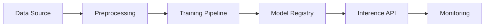

# [Project Name]


> **TL;DR**: [One sentence summary of the project purpose, main tech stack, and key capability].

---

## 📋 Overview

[Project Name] is a production-grade Machine Learning service designed to [Business Goal]. 

### Key Features
- **Robust Modeling**: [Brief description of model type, e.g., Ensemble, Deep Learning].
- **Production API**: Fast, typed, and documented REST API using FastAPI.
- **Reproducibility**: Full data and pipeline versioning with DVC and Git.
- **Observability**: Integrated MLflow tracking and drift monitoring.

### Architecture



---

## 🚀 Quickstart

### Prerequisites
- Python 3.10+
- Docker & Docker Compose
- Make

### Run in 5 Minutes (Demo)

```bash
# 1. Install dependencies
make install

# 2. Start the full stack (API + Monitoring)
make docker-demo

# 3. Check health
curl localhost:8000/health
```

### Request Examples

**Single Prediction:**

```bash
curl -X POST "http://localhost:8000/predict" \
     -H "Content-Type: application/json" \
     -d '{
           "feature1": value1,
           "feature2": value2
         }'
```

**Batch Prediction:**

```bash
curl -X POST "http://localhost:8000/predict_batch" \
     -H "Content-Type: application/json" \
     -d @data/sample_batch.json
```

---

## 💾 Data

| Column | Type | Description |
|--------|------|-------------|
| [Col1] | [Type] | [Description] |
| [Target] | [Type] | **Target Variable** |

Data is versioned using DVC. To pull the latest data:
```bash
dvc pull
```

---

## 🧠 Training

The training pipeline is reproducible and managed via `dvc.yaml` or `Makefile`.

```bash
# Run full training pipeline
make train

# Run with hyperparameter optimization
make train-hyperopt
```

**Artifacts Generated:**
- `models/best_model.pkl`: Serialized model pipeline.
- `models/metrics.json`: Evaluation metrics.
- `models/model_card.md`: Automated model card.

---

## 📡 Serving

The API documentation (Swagger UI) is available at `http://localhost:8000/docs` when the service is running.

**Endpoints:**
- `GET /health`: Liveness probe.
- `POST /predict`: Real-time inference.
- `POST /predict_batch`: Bulk inference.
- `GET /metrics`: Prometheus-compatible metrics.

---

## 📊 Monitoring

- **Experiments**: View runs in MLflow (`http://localhost:5000`).
- **Drift**: Periodic checks compare live traffic against training reference using `evidently`.

---

## 🛠 Troubleshooting

| Issue | Possible Cause | Fix |
|-------|----------------|-----|
| `ModuleNotFoundError` | PYTHONPATH not set | Run via `python -m` or use `make` commands. |
| `Connection Refused` | Docker container down | Check `docker ps` and logs `docker logs [container_id]`. |

---

## 👥 Maintainers

- **[Name]** - Lead MLOps Engineer

---

## ✅ Acceptance Checklist

- [ ] Tests pass (`make test`)
- [ ] API starts and responds (`make api-start`)
- [ ] Docker image builds (`make docker-build`)
- [ ] Security scan passes (`make security-scan`)
